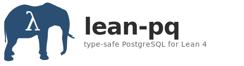

<p align="center">
  
</p>

<p align="center">
  Type-safe PostgreSQL bindings for Lean 4 via libpq FFI.
</p>

<p align="center">
  <a href="https://github.com/typednotes/lean-pq/actions"></a>
  <a href="https://github.com/typednotes/lean-pq/stargazers"></a>
  <a href="https://github.com/typednotes/lean-pq/blob/main/LICENSE"></a>
  <a href="https://github.com/typednotes/lean-pq"></a>
  <a href="https://lean-lang.org/"></a>
</p>

<p align="center">
  <strong>Compile-time column verification</strong> &middot; <strong>Permission-tracked queries</strong> &middot; <strong>Structural injection prevention</strong>
</p>

---

lean-pq makes invalid database operations a **compile-time error**. Column references carry proofs, permissions are tracked in the type system, and user values are structurally separated from SQL — no runtime checks, no overhead.

## Compile-time column verification

Column references in queries carry a **proof** that the column exists in the schema. Reference a column that doesn't exist and the code won't compile.

```lean
def users : TableSchema :=
  { name := "users"
    columns := [
      { name := "id",    type := .serial,  nullable := false },
      { name := "name",  type := .text,    nullable := false },
      { name := "email", type := .text,    nullable := false },
      { name := "age",   type := .integer, nullable := true }
    ] }

-- Compiles: "name" exists in the schema
def valid : Expr users.columns := .col "name" (by decide)

-- Won't compile: "phone" is not a column
-- def bad : Expr users.columns := .col "phone" (by decide)
```

The `by decide` tactic evaluates the membership check at compile time. No reflection, no runtime cost — the proof is erased after elaboration.

[**Try it live**](https://live.lean-lang.org/#code=--%20lean-pq%3A%20Compile-time%20column%20verification%0A--%20Column%20references%20carry%20proofs%20that%20the%20column%20exists%0A%0Astructure%20Column%20where%0A%20%20name%20%3A%20String%0A%20%20deriving%20BEq%0A%0Astructure%20TableSchema%20where%0A%20%20name%20%3A%20String%0A%20%20columns%20%3A%20List%20Column%0A%0Adef%20TableSchema.hasCol%20%28s%20%3A%20TableSchema%29%20%28colName%20%3A%20String%29%20%3A%20Prop%20%3A%3D%0A%20%20s.columns.any%20%28fun%20c%20%3D%3E%20c.name%20%3D%3D%20colName%29%20%3D%20true%0A%0Ainstance%20%28s%20%3A%20TableSchema%29%20%28n%20%3A%20String%29%20%3A%20Decidable%20%28s.hasCol%20n%29%20%3A%3D%0A%20%20inferInstanceAs%20%28Decidable%20_%29%0A%0Ainductive%20Expr%20%28columns%20%3A%20List%20Column%29%20where%0A%20%20%7C%20col%20%28name%20%3A%20String%29%20%28h%20%3A%20columns.any%20%28fun%20c%20%3D%3E%20c.name%20%3D%3D%20name%29%20%3D%20true%29%0A%20%20%7C%20litStr%20%28value%20%3A%20String%29%0A%20%20%7C%20litInt%20%28value%20%3A%20Int%29%0A%0Adef%20users%20%3A%20TableSchema%20%3A%3D%0A%20%20%7B%20name%20%3A%3D%20%22users%22%2C%20columns%20%3A%3D%20%5B%E2%9F%A8%22id%22%E2%9F%A9%2C%20%E2%9F%A8%22name%22%E2%9F%A9%2C%20%E2%9F%A8%22email%22%E2%9F%A9%2C%20%E2%9F%A8%22age%22%E2%9F%A9%5D%20%7D%0A%0A--%20%E2%9C%93%20Compiles%3A%20%22name%22%20exists%20in%20the%20schema%0Adef%20validRef%20%3A%20Expr%20users.columns%20%3A%3D%20.col%20%22name%22%20%28by%20decide%29%0A%0A--%20%E2%9C%97%20Uncomment%20%E2%86%92%20compile%20error%3A%20%22phone%22%20is%20not%20a%20column%0A--%20def%20bad%20%3A%20Expr%20users.columns%20%3A%3D%20.col%20%22phone%22%20%28by%20decide%29%0A%0A%23check%20validRef%0A) — uncomment the `bad` definition to see the compile error.

## Permission-tracking monad

`PqM perm α` tracks the permission level in the type. SELECT operations live in `readOnly`, INSERT/UPDATE/DELETE in `dataAltering`, DDL in `admin`. Lower permissions lift into higher contexts automatically, but the reverse is a type error.

```lean
-- Compiles: SELECT lifts into dataAltering context
def migrate : PqM .dataAltering Unit := do
  let rows ← PqM.query (pq! select schema)    -- readOnly, lifts up
  let _ ← PqM.execModify "INSERT INTO ..."     -- dataAltering, matches
  pure ()

-- Won't compile: can't use INSERT in a readOnly context
-- def oops : PqM .readOnly Unit := do
--   let _ ← PqM.execModify "INSERT INTO ..."
```

Permissions are a compile-time artifact — erased at runtime with zero overhead. The `PqM` monad is a reader over the connection handle, and `MonadLift` instances handle the subtyping.

[**Try it live**](https://live.lean-lang.org/#code=--%20lean-pq%3A%20Permission-tracking%20monad%0A--%20Operations%20are%20gated%20by%20permission%20level%20at%20the%20type%20level%0A%0Ainductive%20Permission%20where%0A%20%20%7C%20readOnly%20%7C%20dataAltering%20%7C%20admin%0A%0Astructure%20PqM%20%28perm%20%3A%20Permission%29%20%28%CE%B1%20%3A%20Type%29%20where%0A%20%20run%20%3A%20%CE%B1%0A%0Ainstance%20%3A%20Monad%20%28PqM%20perm%29%20where%0A%20%20pure%20a%20%3A%3D%20%E2%9F%A8a%E2%9F%A9%0A%20%20bind%20m%20f%20%3A%3D%20f%20m.run%0A%0Ainstance%20%3A%20MonadLift%20%28PqM%20.readOnly%29%20%28PqM%20.dataAltering%29%20where%0A%20%20monadLift%20m%20%3A%3D%20%E2%9F%A8m.run%E2%9F%A9%0A%0Ainstance%20%3A%20MonadLift%20%28PqM%20.readOnly%29%20%28PqM%20.admin%29%20where%0A%20%20monadLift%20m%20%3A%3D%20%E2%9F%A8m.run%E2%9F%A9%0A%0Adef%20execSelect%20%28sql%20%3A%20String%29%20%3A%20PqM%20.readOnly%20String%20%3A%3D%20%E2%9F%A8sql%E2%9F%A9%0Adef%20execModify%20%28sql%20%3A%20String%29%20%3A%20PqM%20.dataAltering%20String%20%3A%3D%20%E2%9F%A8sql%E2%9F%A9%0A%0A--%20%E2%9C%93%20Compiles%3A%20SELECT%20lifts%20into%20dataAltering%0Adef%20safeOp%20%3A%20PqM%20.dataAltering%20String%20%3A%3D%20do%0A%20%20let%20_%20%E2%86%90%20execSelect%20%22SELECT%20%2A%20FROM%20users%22%0A%20%20execModify%20%22INSERT%20INTO%20users%20VALUES%20%28%27Alice%27%29%22%0A%0A--%20%E2%9C%97%20Uncomment%20%E2%86%92%20compile%20error%3A%20can%27t%20use%20INSERT%20in%20readOnly%0A--%20def%20unsafeOp%20%3A%20PqM%20.readOnly%20String%20%3A%3D%20do%0A--%20%20%20execModify%20%22INSERT%20INTO%20users%20VALUES%20%28%27Eve%27%29%22%0A%0A%23check%20safeOp%0A) — uncomment `unsafeOp` to see the permission violation.

## Structural SQL injection prevention

User values never appear in the SQL string. The query AST renders all literals as `$1`, `$2`, ... parameters, making SQL injection **structurally impossible** — not by escaping, but by construction.

```lean
-- Malicious input is safely contained in the parameter array
let userInput := "Robert'; DROP TABLE users;--"
let q := pq! select users | name = userInput
let (sql, params) := q.render
-- sql:    "SELECT * FROM users WHERE (name = $1)"
-- params: #["Robert'; DROP TABLE users;--"]
```

[**Try it live**](https://live.lean-lang.org/#code=--%20lean-pq%3A%20Structural%20SQL%20injection%20prevention%0A--%20The%20AST%20separates%20values%20from%20SQL%2C%20making%20injection%20impossible%0A%0Astructure%20RenderState%20where%0A%20%20params%20%3A%20Array%20String%20%3A%3D%20%23%5B%5D%0A%20%20nextIdx%20%3A%20Nat%20%3A%3D%201%0A%0Ainductive%20Expr%20where%0A%20%20%7C%20col%20%28name%20%3A%20String%29%0A%20%20%7C%20litStr%20%28value%20%3A%20String%29%0A%20%20%7C%20litInt%20%28value%20%3A%20Int%29%0A%20%20%7C%20binOp%20%28op%20%3A%20String%29%20%28lhs%20rhs%20%3A%20Expr%29%0A%0Adef%20Expr.render%20%3A%20Expr%20%E2%86%92%20RenderState%20%E2%86%92%20%28String%20%C3%97%20RenderState%29%0A%20%20%7C%20.col%20name%2C%20st%20%3D%3E%20%28name%2C%20st%29%0A%20%20%7C%20.litStr%20value%2C%20st%20%3D%3E%0A%20%20%20%20let%20idx%20%3A%3D%20st.nextIdx%0A%20%20%20%20%28s%21%22%24%7Bidx%7D%22%2C%20%7B%20params%20%3A%3D%20st.params.push%20value%2C%20nextIdx%20%3A%3D%20idx%20%2B%201%20%7D%29%0A%20%20%7C%20.litInt%20value%2C%20st%20%3D%3E%0A%20%20%20%20let%20idx%20%3A%3D%20st.nextIdx%0A%20%20%20%20%28s%21%22%24%7Bidx%7D%22%2C%20%7B%20params%20%3A%3D%20st.params.push%20%28toString%20value%29%2C%20nextIdx%20%3A%3D%20idx%20%2B%201%20%7D%29%0A%20%20%7C%20.binOp%20op%20lhs%20rhs%2C%20st%20%3D%3E%0A%20%20%20%20let%20%28l%2C%20st%29%20%3A%3D%20lhs.render%20st%0A%20%20%20%20let%20%28r%2C%20st%29%20%3A%3D%20rhs.render%20st%0A%20%20%20%20%28s%21%22%28%7Bl%7D%20%7Bop%7D%20%7Br%7D%29%22%2C%20st%29%0A%0A--%20User%20input%20is%20ALWAYS%20a%20parameter%2C%20never%20interpolated%20into%20SQL%0Adef%20userInput%20%3A%3D%20%22Robert%27%3B%20DROP%20TABLE%20users%3B--%22%0A%0Adef%20query%20%3A%20Expr%20%3A%3D%20.binOp%20%22%3D%22%20%28.col%20%22name%22%29%20%28.litStr%20userInput%29%0A%0Adef%20main%20%3A%20IO%20Unit%20%3A%3D%20do%0A%20%20let%20%28sql%2C%20st%29%20%3A%3D%20query.render%20%7B%7D%0A%20%20IO.println%20s%21%22SQL%3A%20%20%20%20SELECT%20%2A%20FROM%20users%20WHERE%20%7Bsql%7D%22%0A%20%20IO.println%20s%21%22Params%3A%20%7Bst.params%7D%22%0A%20%20IO.println%20%22--%20The%20malicious%20input%20is%20safely%20contained%20in%20params%21%22%0A) — run it to see the injection attempt safely contained.

## The `pq!` macro

A SQL-like DSL that expands to the typed `Query` AST at compile time. Column names are verified against the schema, values become parameters, and the required permission level is inferred.

```lean
open LeanPq.Syntax

let products : TableSchema := { name := "products", columns := [
  { name := "id",       type := .serial,                    nullable := false },
  { name := "name",     type := .text,                      nullable := false },
  { name := "price",    type := .numeric (some 10) (some 2), nullable := false },
  { name := "in_stock", type := .boolean,                   nullable := false }
] }

-- SELECT with WHERE, ORDER BY, LIMIT
pq! select products [name, price] | price > "5.00" orderby price desc limit 10
-- → "SELECT name, price FROM products WHERE (price > $1) ORDER BY price DESC LIMIT 10"
--   params: #["5.00"]

-- INSERT
pq! insert products [name, price, in_stock] ["Widget", "9.99", true]
-- → "INSERT INTO products (name, price, in_stock) VALUES ($1, $2, TRUE)"
--   params: #["Widget", "9.99"]

-- UPDATE with WHERE
pq! update products [price := "12.99"] | name = "Widget"
-- → "UPDATE products SET price = $1 WHERE (name = $2)"

-- DELETE, CREATE, DROP
pq! delete products | name = "Widget"
pq! create products
pq! drop_if_exists products
```

Expressions support `=`, `!=`, `>`, `<`, `>=`, `<=`, `&&`, `||`, `!`, `like`, `ilike`, `is_null`, `is_not_null`.

## Full CRUD example

```lean
import LeanPq

open LeanPq
open LeanPq.Syntax

def main : IO Unit :=
  PqM.withConnectionIO (perm := .admin) "host=localhost dbname=mydb" do
    let schema : TableSchema :=
      { name := "users"
        columns := [
          { name := "id",    type := .serial,  nullable := false },
          { name := "name",  type := .text,    nullable := false },
          { name := "email", type := .text,    nullable := false }
        ] }

    let _ ← PqM.execQuery (pq! drop_if_exists schema)
    let _ ← PqM.execQuery (pq! create schema)

    let _ ← PqM.execQuery (pq! insert schema [name, email] ["Alice", "alice@example.com"])
    let _ ← PqM.execQuery (pq! insert schema [name, email] ["Bob", "bob@example.com"])

    let rows ← PqM.query (pq! select schema [name] | name = "Alice")
    PqM.liftIO (IO.println s!"Found: {rows}")   -- [["Alice"]]

    let _ ← PqM.execQuery (pq! update schema [email := "new@example.com"] | name = "Bob")
    let _ ← PqM.execQuery (pq! delete schema | name = "Bob")
    let _ ← PqM.execQuery (pq! drop_if_exists schema)
```

## Async queries

Each concurrent query runs on its own connection via Lean tasks. No locks, no shared mutable state.

```lean
-- Run three queries in parallel, each on a fresh connection
let results ← PqM.concurrent conninfo [
  do let r ← PqM.execSelect "SELECT count(*) FROM orders;";  PqM.fetchAll r,
  do let r ← PqM.execSelect "SELECT count(*) FROM users;";   PqM.fetchAll r,
  do let r ← PqM.execSelect "SELECT count(*) FROM products;"; PqM.fetchAll r
]

-- Spawn a background query and await it later
let task ← PqM.spawnOnNewConn conninfo do
  let r ← PqM.execSelect "SELECT * FROM large_table;"
  PqM.fetchAll r
-- ... do other work on the current connection ...
let rows ← PqM.await task

-- Run two queries concurrently, get both results
let (users, orders) ← PqM.both conninfo
  (do let r ← PqM.execSelect "SELECT * FROM users;"; PqM.fetchAll r)
  (do let r ← PqM.execSelect "SELECT * FROM orders;"; PqM.fetchAll r)
```

## Setup

### Prerequisites

- [Lean 4](https://lean-lang.org/) (v4.24.0+)
- `libpq` — `brew install libpq` (macOS) or `apt install libpq-dev` (Ubuntu)
- `pkg-config`

### Add to your project

In your `lakefile.lean`, add lean-pq as a dependency:

```lean
require leanpq from git "https://github.com/user/lean-pq" @ "main"
```

### Build and test

```bash
lake build                                       # build library
docker compose -f Tests/docker-compose.yml up -d  # start test database
lake test                                         # run test suite
```

## Architecture

```
LeanPq/
  Extern.lean    — @[extern] FFI declarations (Handle, PGresult, ~80 libpq bindings)
  extern.c       — C implementations wrapping libpq with Lean external classes
  Error.lean     — LeanPq.Error inductive type
  DataType.lean  — PostgreSQL data type model (Chapter 8)
  Schema.lean    — Column, TableSchema, decidable hasCol
  Monad.lean     — PqM permission-tracking monad
  Query.lean     — SQL AST with schema-indexed expressions, parameterized rendering
  Syntax.lean    — pq! macro DSL
  Async.lean     — PqTask, spawnOnNewConn, concurrent, both
```

Opaque `Handle` and `PGresult` types wrap C pointers with finalizers — the Lean GC calls `PQfinish`/`PQclear` automatically. Enum types (`ConnStatus`, `ExecStatus`) have constructors ordered to match PostgreSQL's C enum ordinals exactly.
